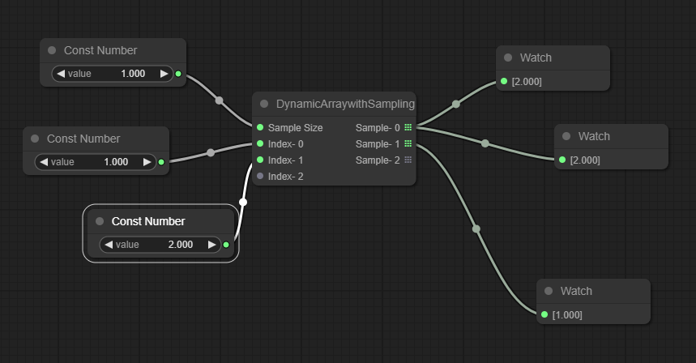

# LiteGraph-VariadicNode



This file contains a base class which is used to create LiteGraph Nodes which accept an arbitrary number of Inputs and/or Outputs.

### Usage
Either copy the `VariadicNode` class into your file or make sure `variadicnode.js` is available from whatever scope you are working in.

Subclass VariadicNode and use `this.addVarInput` or `this.addVarOutput` to indicate Inputs or Outputs- respectively- that should be dynamically added as they are connected to. These functions accept the same arguments as `LGraphNode.addInput` and `LGraphNode.addOutput` as appropriate. These dynamically created Slots will be removed when the connection is removed.

Additional Output Slots are only added when the first connection is made to the latest Output and only removed when an Output loses its last connection.

### Simple Example
A more complete example can be [found here](https://youtu.be/76pfv9-2A-c).
```javascript
class MySumNode extends VariadicNode{
    constructor(o){
        this.addVarInput("Value", "number");
        this.addOutput("Output", "number");
    }

    onExecute(){
        let output = 0
        for(let i = 0; i < this.inputs.length; i++){
            let value = this.getInputData(i);
            if(value) output+=value;
        }

        this.setOutputData(0, output);
    }
}

LiteGraph.registerNodeType("custom/MySumNode", MySumNode);
```

When the MySumNode is added it has an Input named "Value- 0". When the user connects another Node to "Value- 0" a new Input is then created named "Value- 1" and the value of "Value- 0" is added to the Output. If "Value- 1" is connected to, its value will also be added to the Output and a new Input called "Value- 2" is added (and so on).

If the user removes the connection from "Value- 0" then "Value- 0" will be removed from the Node and "Value- 1" will be renamed to "Value- 0" and "Value- 2" will be renamed to "Value-1" in order to maintain the sequential order of the Slots: this method is used as it is simpler than moving the Link from "Value- 1" to "Value- 0" and removing "Value- 2" (keeping in mind that more Links would have to be cascaded down the chain in larger examples).

### Additional Notes
A subclass can override `generateName` in order to implement a more complex naming scheme. `join` can also be overriden to specifically change the joining characters.